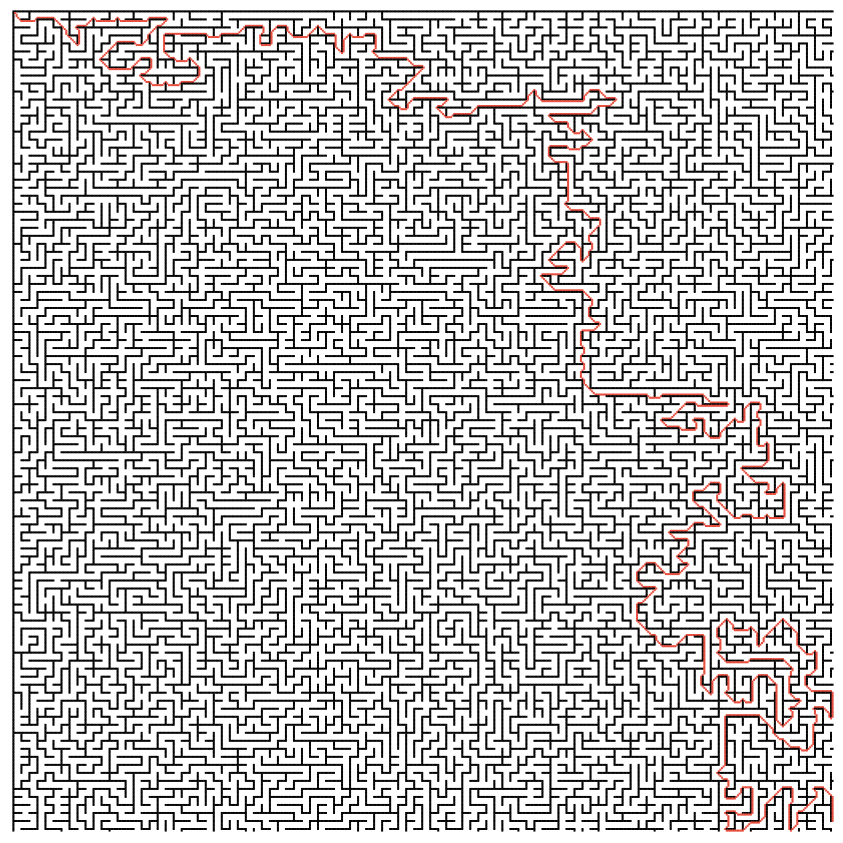
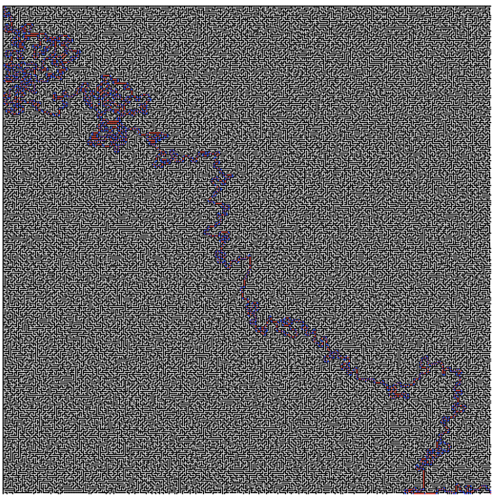
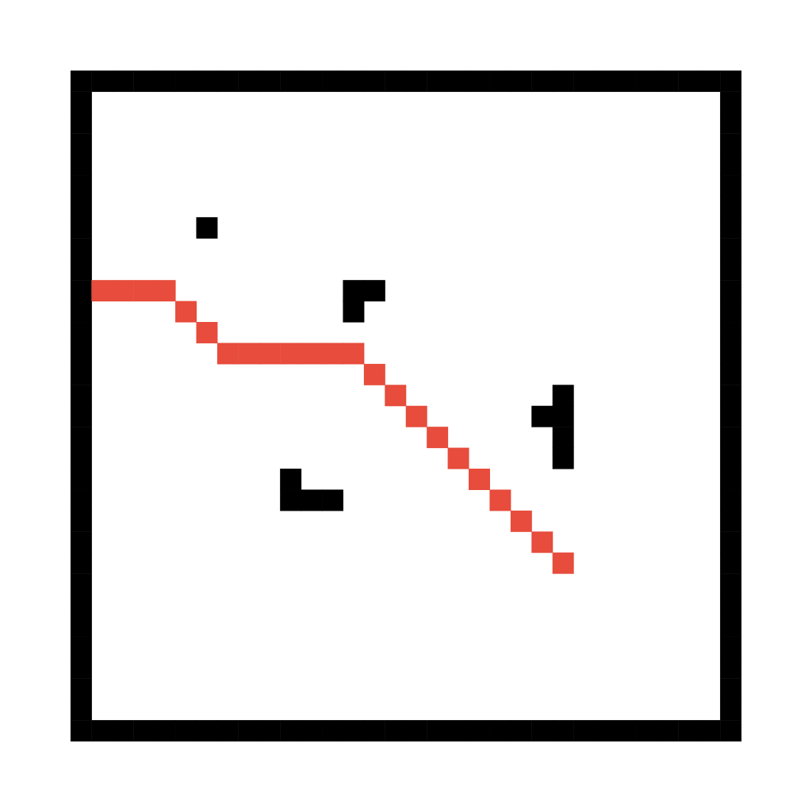
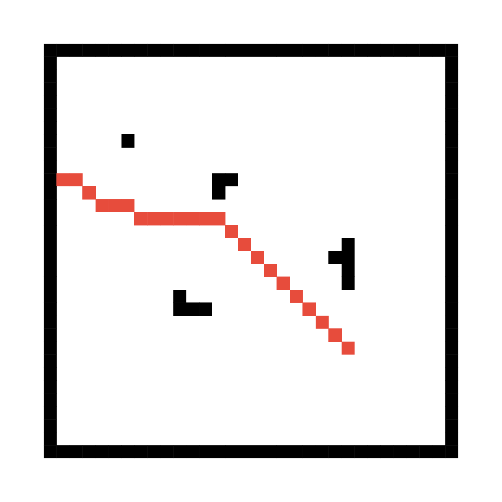
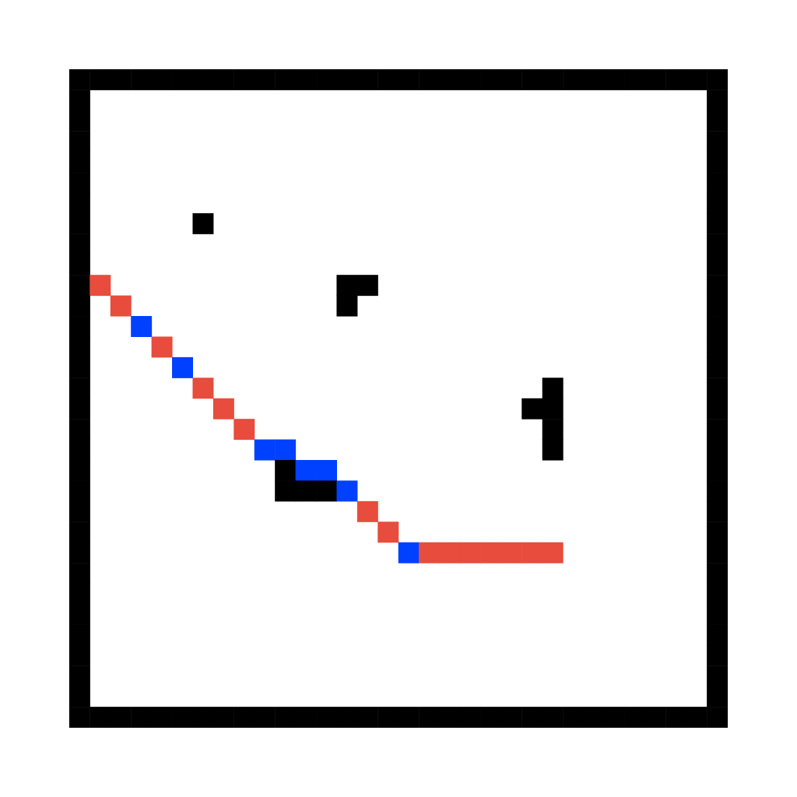

# Testing

Testing is split into the following categories:

- unit testing
- integration testing
- performance testing

### Unit tests

These tests check whether the individual pieces do what they are supposed to do.
Due to time constraints, the unit tests in this project are very limited. As a result, line coverage is essentially 0.

### Integration tests

The purpose of these tests is to ensure that all of the pieces work are working together as intended.
At the moment no integration tests have been implemented.

### Performance tests

These tests determine whether the code performs within reasonable time and space constraints.
For performance testing, different maps from the Moving AI Labs were used as input, and their time to completion, or how long it takes the algorithm to find a shortest route from one node to another, was measured. Each algorithm was ran back to back 10 times to reduce the effect of javascript engine and caching optimizations, as well as random fluctuations in cpu cycles affecting test results.

#### Maze 32-0

This maze is 512x512 and is rather open with large corridors. Starting node was at (1,1) and the destination was at (511,511).

Dijkstra algorithm found the shortest route in 537 ms on average, A\* took 715 ms and JPS managed to solve the maze in 16 ms.
Below is a render of the path that was returned by the Dijkstra algorithm.

#### Maze 4-0

This maze is 512x512 is a lot more densely organized than 32-0. Starting point was (1,1) and the destination was (511, 505).

Dijkstra took 404 ms, A* took 313 ms, and JPS took 16 ms on average.
Below is the route returned by A*.

#### Maze 1-0

This is the densest maze from the list of available maps. Starting point was at (1,1) and the end was at (511,511).

Dijkstra took 310 ms, A\* took 203 ms, and JPS took 61 ms.

Below is the path solved by the JPS algorithm. Blue dots are the jump points.

#### Comparing shortest routes

While the three algorithms all return the shortest path, it is curious that the actual paths are very different.
Image below demonstrates the differences between the shortest paths: from left to right is Dijkstra, A\* and JPS.

<table><tr>
<td></td>
<td></td>
<td></td>
</tr>
<tr>
<td>Dijkstra</td>
<td>A*</td>
<td>JPS</td>
</tr></table>

It can be seen that while Dijkstra and A* have paths that are very similar, JPS takes a different approach. Dijkstra and A* start with horizontal movements and then the last bout is accross a diagonal, while the JPS algorithm starts with diagonal movements and finishes with horizontal movement.

#### Comparing performance

It is clear that JPS is the superior pathfinding algorithm from the three tested ones, at least in the context of this project's algorithm implementations.
The actual difference would probably be less pronounced, had the A\* implementation used binary heap for the open list.

While A* should be faster than Dijkstra since it's an informed algorithm, for the maze_32-0 that was not the case and Dijkstra was substantially faster. In other tests, however, A* was indeed faster.

Going from more sparsely populated mazes to denser ones, the performance of A\* and Dijkstra seemed to improve, while the opposite was observed for JPS. This is not surprising, as JPS was specifically designed to take advantage of any possible symmetries within a grid, and as long straight paths are reduced, so are the distances between the jump points.

## Running tests

Unit and integration tests can be run with `yarn jest test`.
